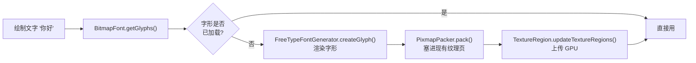
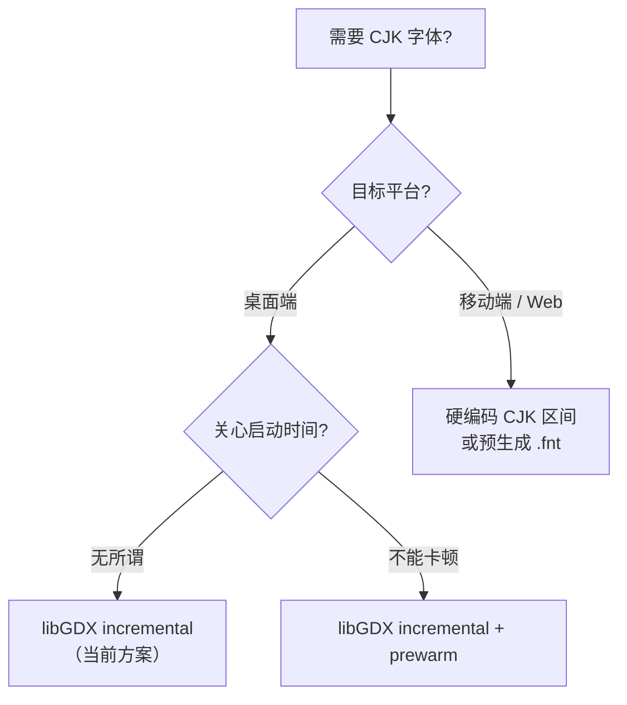

# 字体加载：从 chars.txt 到 lazy load

> 之前 `StyleUtil` 靠 `chars.txt` 维护"会出现的字符白名单"，加一个汉字就要改一次文件。
> 这份文档记录替代方案——libGDX 自带的 incremental 模式，以及社区里历史性的 GDX-lazy-font 封装。

## 1. 为什么会有 chars.txt

`BitmapFont` 在渲染前需要把所有字形打包进纹理图集。libGDX 的 `FreeTypeFontParameter.characters` 是个普通 `String`，只能列出"要打包的字符"——**没有"包含某个 Unicode 区间"的 API**。

如果直接写 `parameter.characters = "我随便说一句话"`，渲染其他汉字时就会显示成空白（或方框）。

于是最朴素的做法就是：把游戏里实际会出现的汉字列在 `chars.txt` 里，启动时读出来塞给 `parameter.characters`。

```text
assets/font/chars.txt   ← 维护成本：每次加新文案都得手动加
```

问题很明显——内容越丰富，字表越长。

## 2. 替代方案一：硬编码 CJK Unicode 区间

最简单的"零维护"做法：直接用代码生成整个 CJK 区间，删掉 chars.txt。

```java
private static String buildCjkChars() {
    StringBuilder sb = new StringBuilder(30000);
    for (int c = 0x4E00; c <= 0x9FFF; c++)  sb.append((char) c); // 基本汉字
    for (int c = 0x3400; c <= 0x4DBF; c++)  sb.append((char) c); // 扩展 A
    for (int c = 0x3000; c <= 0x303F; c++)  sb.append((char) c); // 中文标点
    for (int c = 0xFF00; c <= 0xFFEF; c++)  sb.append((char) c); // 全角字符
    return sb.toString();
}

parameter.characters = FreeTypeFontGenerator.DEFAULT_CHARS + buildCjkChars();
parameter.pageWidth = 1024;
parameter.pageHeight = 1024;
```

| 项 | 估算 |
|---|---|
| 启动时纹理生成时间 | 桌面端 1–3 秒 |
| 显存占用（50px + 24px） | 20–40 MB（lwjgl3 完全 OK） |
| .ttf 文件大小 | **不变** |
| Android / HTML / iOS | **不推荐**——会撑爆 |

桌面游戏够用，但**移动端不行**。

## 3. 替代方案二：libGDX 自带 incremental 模式 ✅ 当前方案

libGDX 的 `FreeTypeFontParameter` 有一个开关：

```java
public boolean incremental;   // 默认 false
```

设为 `true` 后，`FreeTypeBitmapFontData.getGlyph(char)` 会在字形缺失时**自动调 generator 渲染缺失字形、pack 进现有纹理、上传 GPU**——所有"脏活"libGDX 内部都做了，不需要写一行额外代码。



### 实现

```java
public static void init() {
    FontType[] types = FontType.values();
    fonts = new BitmapFont[types.length];

    // generator 必须活得比 font 久，否则后续懒加载会 NPE
    sharedGenerator = new FreeTypeFontGenerator(
        Gdx.files.internal("font/ZCOOLKuaiLe-Regular.ttf"));

    for (int i = 0; i < types.length; i++) {
        // ⚠️ 每个字号必须用独立的 parameter 实例！
        FreeTypeFontGenerator.FreeTypeFontParameter parameter =
            new FreeTypeFontGenerator.FreeTypeFontParameter();
        parameter.characters = FreeTypeFontGenerator.DEFAULT_CHARS;
        parameter.incremental = true;
        parameter.size = types[i].size;
        fonts[i] = sharedGenerator.generateFont(parameter);
    }
}
```

### ⚠️ 坑 1：parameter 不能共享

`FreeTypeBitmapFontData` 会持有 `parameter` 的引用：

```java
// FreeTypeFontGenerator.generateData()
if (incremental) {
    data.generator = this;
    data.parameter = parameter;   // ← 存的是引用！
    data.stroker = stroker;
    data.packer = packer;
}
```

后续懒加载时调 `parameter.size` 来决定 `setPixelSizes`。如果两种字号**共用同一个 parameter** 循环改 `size`，后生成的 font 的 `parameter.size` 会被前一个覆盖。

```java
// ❌ 错误写法 —— 大字号被小字号污染
FreeTypeFontParameter parameter = new FreeTypeFontParameter();
for (int i = 0; i < types.length; i++) {
    parameter.size = types[i].size;
    fonts[i] = sharedGenerator.generateFont(parameter);
    // ↑ generateFont 内部把 parameter 的引用存进了 dataLarge
    //   下次循环改 parameter.size = 24 时，dataLarge 也跟着变 24
}

// ✅ 正确写法 —— 每个字号独立 parameter
for (int i = 0; i < types.length; i++) {
    FreeTypeFontParameter parameter = new FreeTypeFontParameter();
    parameter.incremental = true;
    parameter.size = types[i].size;
    fonts[i] = sharedGenerator.generateFont(parameter);
}
```

**症状**：第一次正常（生成时刻 size 正确），后续某个新汉字出现时变成错误字号渲染出来。

### ⚠️ 坑 2：generator 必须比 font 活得久

incremental 模式下 `font.dispose()` 后如果 generator 还活着 → 没问题；如果 generator 先 dispose → 后续渲染崩 NPE。

```java
public static void dispose() {
    // 顺序：先 font，后 generator
    for (BitmapFont font : fonts) font.dispose();
    sharedGenerator.dispose();
}
```

### 可选：预热消除首帧卡顿

第一次遇到某个新汉字时，会有几十毫秒延迟（生成字形 + pack + 上传 GPU）。如果场景对延迟敏感，可以预热：

```java
public static void prewarm(CharSequence chars) {
    for (BitmapFont font : fonts) {
        BitmapFont.BitmapFontData data = font.getData();
        for (int i = 0, n = chars.length(); i < n; i++) {
            data.getGlyph(chars.charAt(i));   // 触发懒加载
        }
    }
}

// 用法：进入战斗场景前预热
StyleUtil.prewarm("生命值攻击防御回合胜负普通暴击…");
```

实际测下来延迟通常 < 16ms，桌面端感知不到，所以本项目暂未启用。

## 4. 替代方案三：GDX-lazy-font（历史社区方案）

[dingjibang/GDX-lazy-font](https://github.com/dingjibang/GDX-lazy-font)（⭐27，作者是国人）是个早期封装，本质是**自己写一个 `BitmapFont` 子类**，在 `draw()` 时调 `FreeTypeFontGenerator` 生成缺失字形。

```java
LazyBitmapFont font = new LazyBitmapFont(generator, 24);
font.draw(batch, "我随便说一句话就能够组成十五字", 100, 200);  // API 与 BitmapFont 一致
```

它在 libGDX 1.9 时代很有用，因为那时候官方 incremental 模式的支持还很弱。

**libGDX 1.12 之后 incremental 模式被官方完善**——`FreeTypeBitmapFontData.getGlyph()` 内部已经实现了 GDX-lazy-font 想做的事：

```java
// libGDX 1.14 官方源码 —— 与 GDX-lazy-font 的核心逻辑完全一致
@Override
public Glyph getGlyph (char ch) {
    Glyph glyph = super.getGlyph(ch);
    if (glyph == null && generator != null) {
        generator.setPixelSizes(0, parameter.size);
        glyph = generator.createGlyph(ch, this, parameter, stroker, baseline, packer);
        // ...
    }
    return glyph;
}
```

所以 **GDX-lazy-font 在当前 libGDX 版本下已经没有存在必要**——自己写 5 行用 `incremental = true` 就能达到完全一样的效果。

### libGDX 官方 incremental vs GDX-lazy-font 对比

| 维度 | libGDX incremental | GDX-lazy-font |
|---|---|---|
| 维护状态 | ✅ 官方支持 | ⚠️ 停在 libGDX 1.9 时代 |
| 外部依赖 | 无 | 1 个第三方库（已不维护） |
| 跨版本兼容 | ✅ 跟随 libGDX 升级 | ❌ 1.12+ 需要打补丁 |
| Scene2d Label 兼容 | ✅ 透明兼容 | ✅ 透明兼容 |
| 性能 | 一致 | 一致 |
| 多字号管理 | ⚠️ 注意 parameter 共享坑 | 同 |
| 多字体 fallback | 需要自己写 `FreeTypeBitmapFontData` 子类 | 不直接支持 |

## 5. 进阶：多字体 fallback（emoji / 多语言）

如果以后需要"英文字体 + 中文 fallback + emoji fallback"这种场景，可以在 incremental 基础上扩展：

```java
// 参考 https://lyze.dev/2021/12/22/libGDX-FreeTypeFontGenerator-FallbacksFonts/
FreeTypeBitmapFontData data = new FreeTypeBitmapFontData() {
    @Override
    public Glyph getGlyph(char ch) {
        Glyph glyph = super.getGlyph(ch);
        if (glyph != null) return glyph;
        for (BitmapFont fallback : fallbackFonts.values()) {
            glyph = fallback.getData().getGlyph(ch);
            if (glyph != null) return glyph;
        }
        return null;
    }
};

parameter.incremental = true;
BitmapFont font = baseGenerator.generateFont(parameter, data);
```

## 6. 选型建议



| 场景 | 推荐 |
|---|---|
| 桌面游戏（CJK 不超过几千字） | ✅ **incremental = true**（当前方案） |
| 移动端 / Web，固定文案 | 预生成 .fnt + 打包进 assets |
| 移动端 / Web，动态文案 | 硬编码 CJK 区间 + 大纹理页 |
| 需要 emoji / 多语言混合 | incremental + fallback 字体 |

## 7. 参考

- [libGDX gdx-freetype 文档](https://libgdx.com/wiki/extensions/gdx-freetype)
- [FreeTypeFontGenerator 源码](https://github.com/libgdx/libgdx/blob/master/extensions/gdx-freetype/src/com/badlogic/gdx/graphics/g2d/freetype/FreeTypeFontGenerator.java)
- [libGDX issue #1154: add glyphs after fully creating BitmapFont](https://github.com/libgdx/libgdx/issues/1154) —— incremental 模式的核心 issue 讨论
- [dingjibang/GDX-lazy-font](https://github.com/dingjibang/GDX-lazy-font) —— 国人开发的早期懒加载封装
- [Lyze.Dev: FreeType Font Generate Fallback Fonts](https://lyze.dev/2021/12/22/libGDX-FreeTypeFontGenerator-FallbacksFonts/) —— fallback 字体方案

